# V3000 Bootloader Architecture Diagrams

This document provides comprehensive visual documentation of the V3000 bootloader architecture, boot sequence, and component relationships.

---

## Table of Contents

1. [System Architecture Overview](#1-system-architecture-overview)
2. [Hardware/Software Stack](#2-hardwaresoftware-stack)
3. [Boot Sequence Timeline](#3-boot-sequence-timeline)
4. [Component Relationships](#4-component-relationships)
5. [Memory Layout](#5-memory-layout)
6. [Build and Flash Pipeline](#6-build-and-flash-pipeline)
7. [Handoff Protocol Details](#7-handoff-protocol-details)

---

## 1. System Architecture Overview

### 1.1 Complete System Context

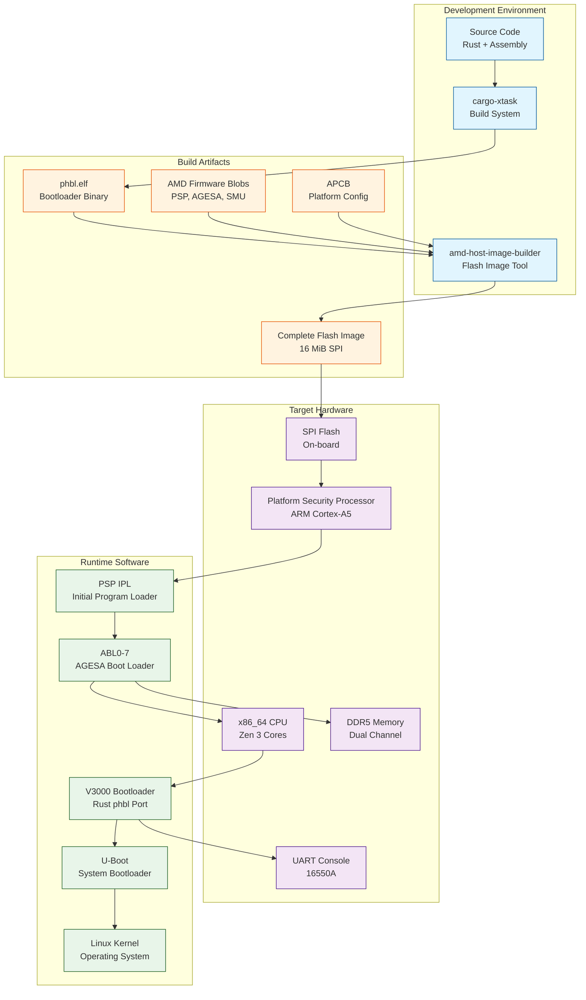

### 1.2 Oxide Project Relationships

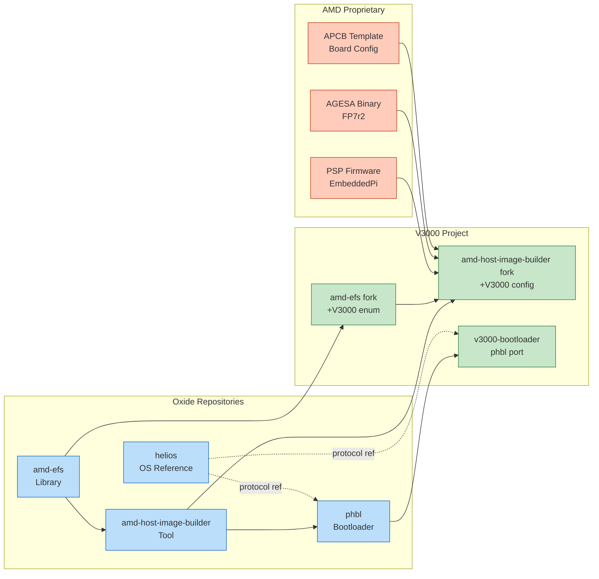

---

## 2. Hardware/Software Stack

### 2.1 Layered Architecture

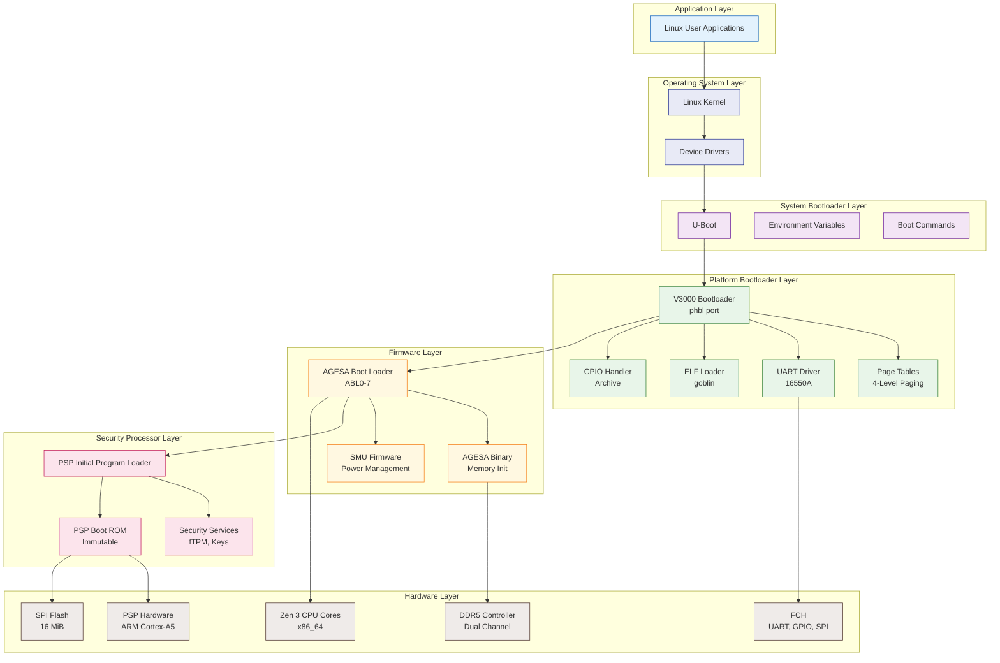

### 2.2 Code Reusability by Layer

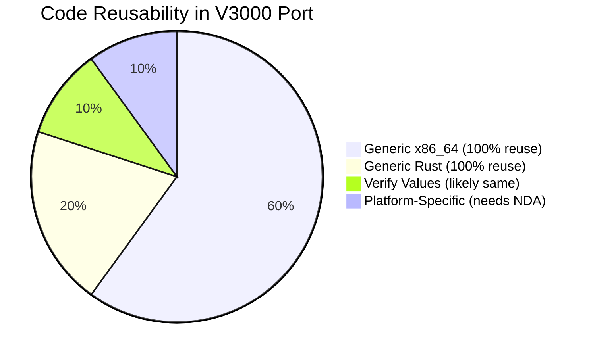

---

## 3. Boot Sequence Timeline

### 3.1 Complete Boot Sequence with Timing

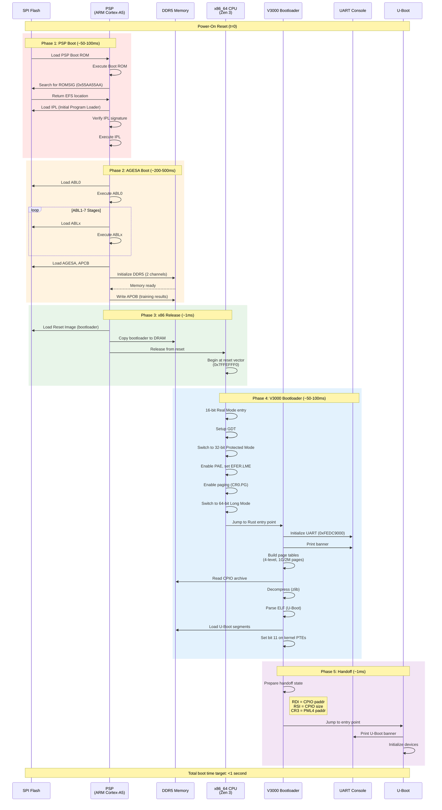

### 3.2 Critical Handoff Points

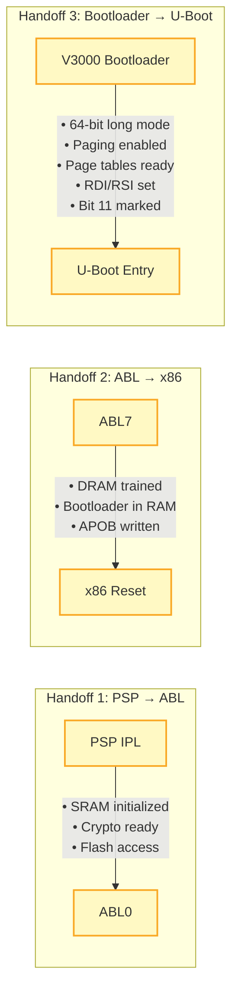

### 3.3 CPU Mode Transitions Detail

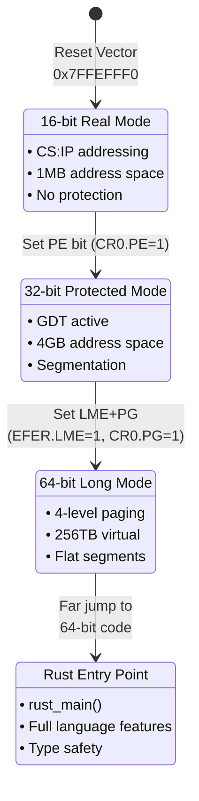

---

## 4. Component Relationships

### 4.1 phbl Internal Architecture

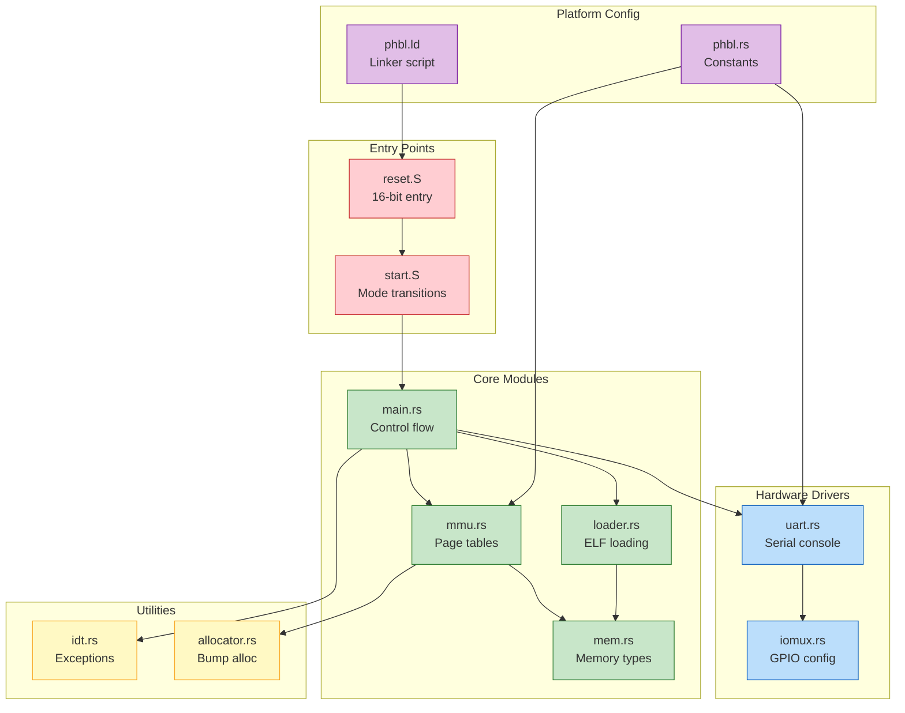

### 4.2 Data Flow During Boot

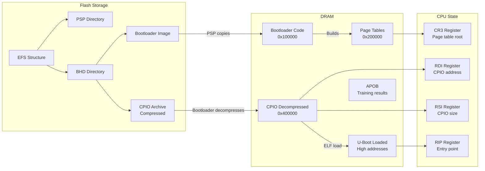

### 4.3 Dependency Graph

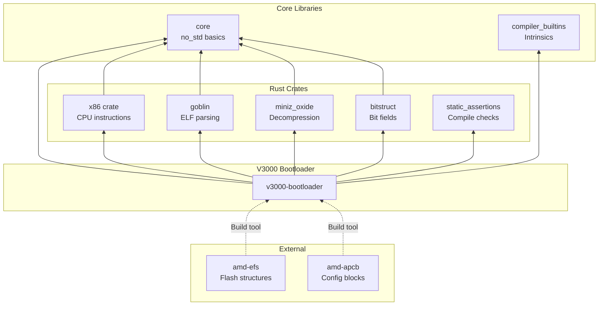

---

## 5. Memory Layout

### 5.1 Physical Memory Map

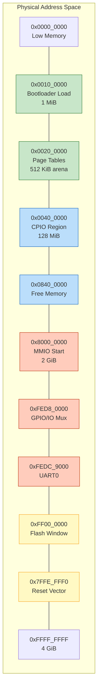

### 5.2 Virtual Address Mapping

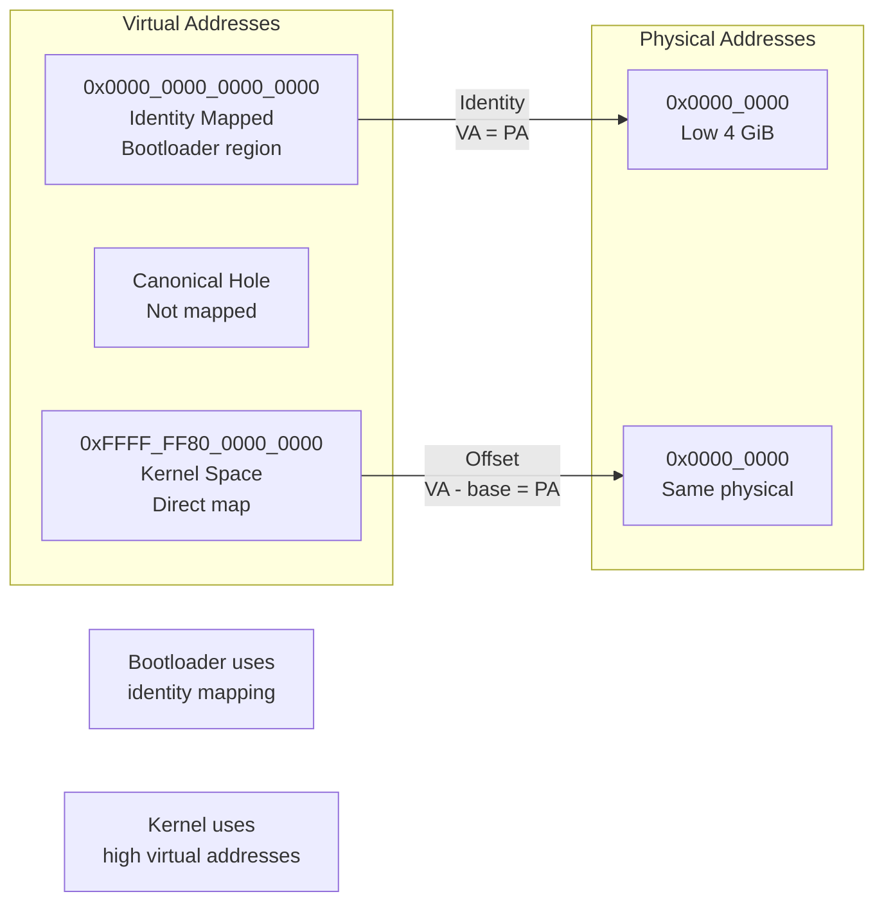

### 5.3 Page Table Structure

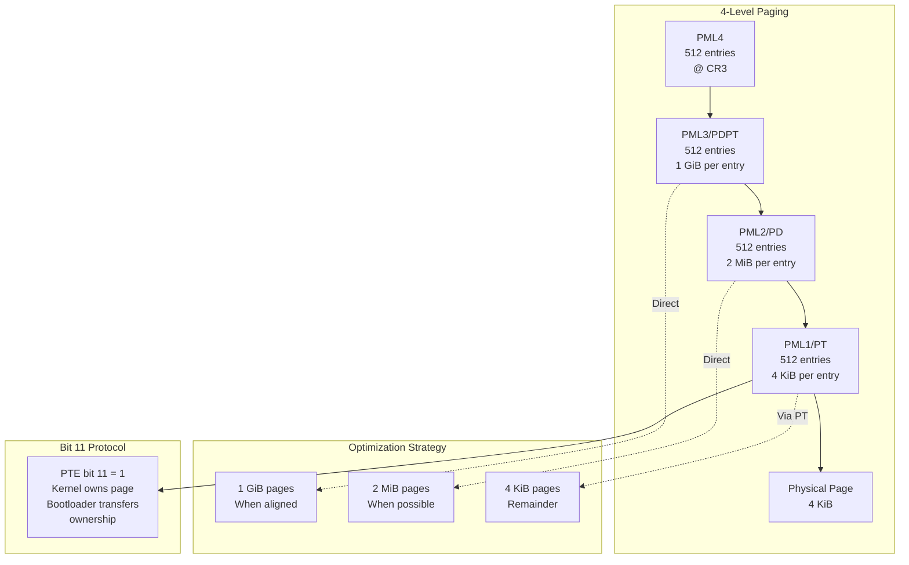

---

## 6. Build and Flash Pipeline

### 6.1 Build Process

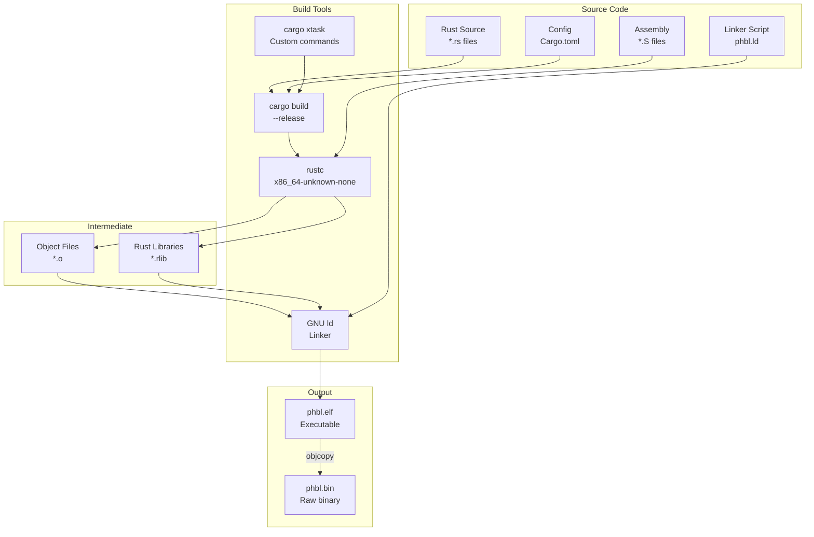

### 6.2 Flash Image Assembly

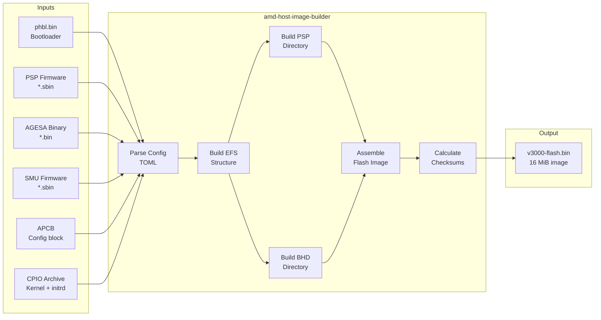

### 6.3 Flash Layout Structure

```mermaid
graph TB
    subgraph "16 MiB SPI Flash"
        direction TB

        EFS_HDR[0x00_0000<br/>EFS Header]
        PSP_L1[0x02_0000<br/>PSP Directory L1]
        PSP_L2[0x04_0000<br/>PSP Directory L2]
        BHD_L1[0x06_0000<br/>BHD Directory L1]
        BHD_L2[0x08_0000<br/>BHD Directory L2]

        PSP_FW[0x10_0000<br/>PSP Firmware Blobs]
        AGESA_BL[0x40_0000<br/>AGESA/ABL Blobs]

        APCB_A[0x80_0000<br/>APCB Primary]
        APCB_B[0x84_0000<br/>APCB Backup]

        APOB[0x90_0000<br/>APOB<br/>(Written by PSP)]

        BOOT_A[0xA0_0000<br/>Bootloader A]
        BOOT_B[0xC0_0000<br/>Bootloader B<br/>(Redundancy)]

        CPIO_A[0xE0_0000<br/>CPIO Archive]

        TOP[0xFF_FFFF<br/>End of Flash]
    end

    EFS_HDR --- PSP_L1
    PSP_L1 --- PSP_L2
    PSP_L2 --- BHD_L1
    BHD_L1 --- BHD_L2
    BHD_L2 --- PSP_FW
    PSP_FW --- AGESA_BL
    AGESA_BL --- APCB_A
    APCB_A --- APCB_B
    APCB_B --- APOB
    APOB --- BOOT_A
    BOOT_A --- BOOT_B
    BOOT_B --- CPIO_A
    CPIO_A --- TOP

    classDef dir fill:#e1bee7,stroke:#7b1fa2
    classDef fw fill:#ffccbc,stroke:#bf360c
    classDef config fill:#fff9c4,stroke:#f9a825
    classDef boot fill:#c8e6c9,stroke:#2e7d32
    classDef data fill:#bbdefb,stroke:#1565c0

    class EFS_HDR,PSP_L1,PSP_L2,BHD_L1,BHD_L2 dir
    class PSP_FW,AGESA_BL fw
    class APCB_A,APCB_B,APOB config
    class BOOT_A,BOOT_B boot
    class CPIO_A data
```

---

## 7. Handoff Protocol Details

### 7.1 Bootloader to Kernel/U-Boot Handoff

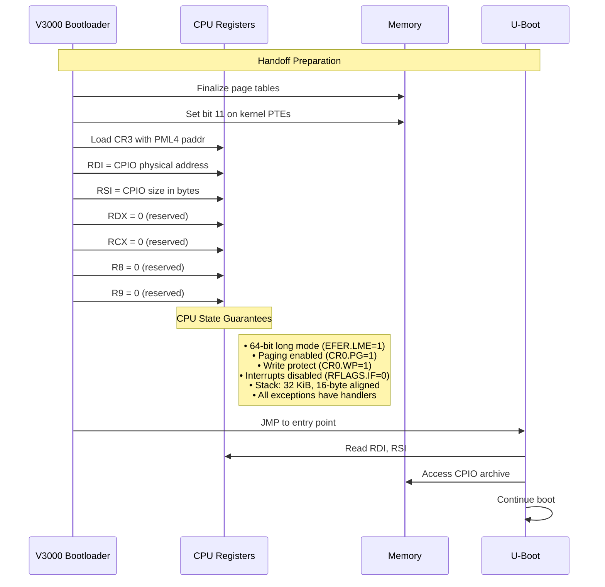

### 7.2 Register State at Handoff

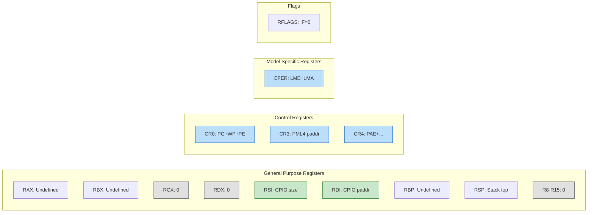

### 7.3 Page Table Entry with Bit 11

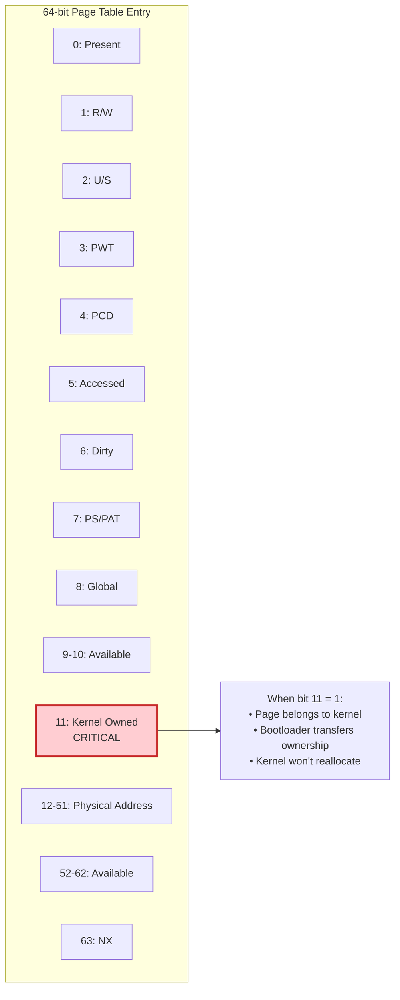

---

## Summary

These diagrams illustrate the complete V3000 bootloader architecture:

1. **System Architecture**: Shows all components and their relationships
2. **Hardware/Software Stack**: Layered view from hardware to applications
3. **Boot Sequence**: Timeline with timing estimates and handoff points
4. **Component Relationships**: Internal phbl structure and dependencies
5. **Memory Layout**: Physical and virtual address space organization
6. **Build Pipeline**: From source to flash image
7. **Handoff Protocol**: Detailed register and memory state requirements

Key takeaways:
- **80% of code is generic x86_64** - reusable without modification
- **Critical handoff points** are well-defined with clear state requirements
- **Bit 11 protocol** is essential for kernel page ownership transfer
- **Total boot time target** is under 1 second
- **Extension points** are clearly defined for adding V3000 support
